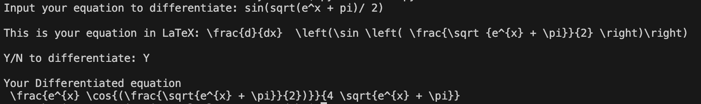
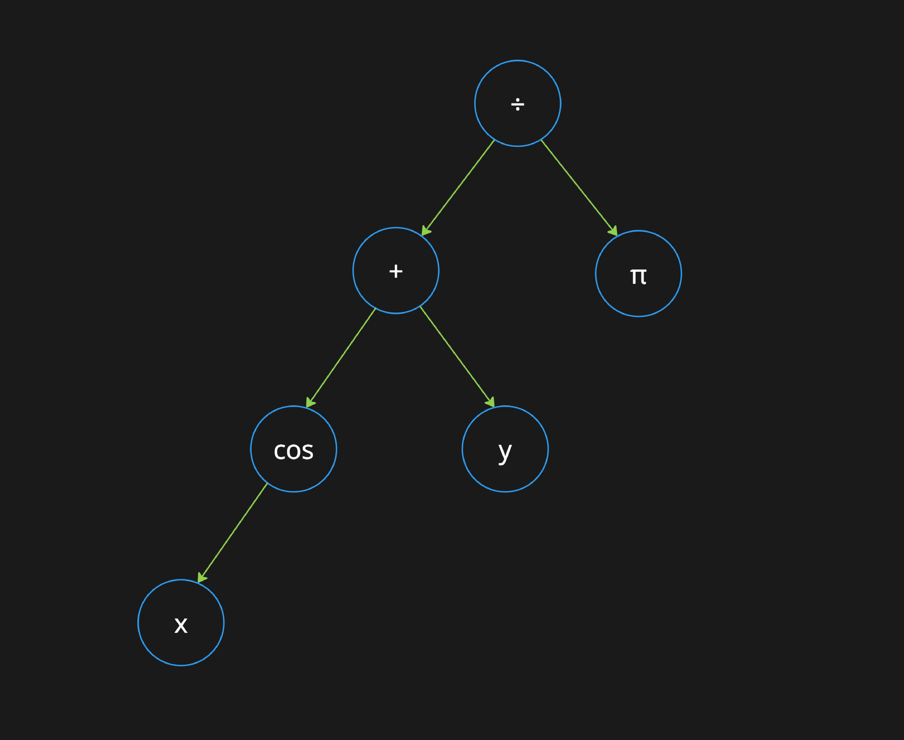

# Derivative-calculator
This project is a Derivative Calculator that can convert your given equation into a LaTeX equation using a parser and Abstract Syntax Tree (AST), which then finds the derivative in LaTeX. It currently implements the `main.py` for the CLI as its main functionality.

All functionalities:
* Can convert simple and user friendly equations
* Supports the use of addition(`+`), subtraction(`-`), multiplication(`*`), division(`/`), and exponentiation(`^`)
* All elementary functions are supported these include:  
    * Square root. $\sqrt{}$
    * Trigonometric functions. Like $\tan$.
    * Inverse Trig functions. Like $\arccos$
    * Hyperbolic Trig functions. Like $\sinh$.
    * Inverse Hyperbolic Trig functions. Like $\text{arccoth}$.
    * This is with the exceptions of logarithms with bases not in $e$ and $10$ ($\ln$ and $\log$ will work but $\log_e$ or $\log_{10}$ or $\log_2$ will not). 
* All constants are supported. The entire Greek alphabet, such as pi &rarr; $\pi$ or omega &rarr; $\omega$. 
* Reads implicit multiplication, such as where $xy$ will be read as $x \cdot y$
* Unary negatives, such as $-(x+y)$. 
* All function inputs must be inside of brackets, an example would be for $\sin(x)$, where the $x$ is inside braces, which is not equivalent to $sinx$, where each $s$, $i$, $n$ and $x$ are all variables. This is to avoid confusion between the calculator and user that is inputting the values.

The calculator currently only supports the use of differentiating in terms of $x$. In addition this calculator does not support functionalities that are `**`, `{}`, `[]`. Furthermore, when inputting your equation, make sure there are no `\` in the equation even in front of **constants**. There will be future changes so that these can be implemented in the calculator.

This project implements the package of [latex2sympy](https://pypi.org/project/latex2sympy2/) which is a parser for LaTeX math expressions that is converted to the equivalent [SymPy](https://www.sympy.org/en/index.html) form.

If you wish to try it out, download the file, and make sure you have all packages downloaded using `pip`. Now run `main.py` and input your LaTeX equations and your differentiated equation will be outputted in LaTeX!

## Abstract Syntax Tree
The idea of the AST is that we can parse through whatever the user wants to input, which then allows the computer to know what the input is actually meant to be. A good question to ask is how does a computer know what the function $\cos{x}$ means, it may intrepret it as $c\cdot o \cdot s \cdot x$ instead. The AST solves all these issues and is able to determine what the function would look like. Below is a an example of what the AST looks like with the input (cos(x)+y)/pi which in LaTeX would be: $\frac{\cos(x)+y}{\pi}$.

