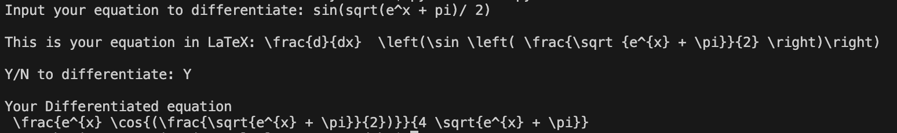

# Derivative-calculator
This project is a Derivative Calculator that can convert your given equation into a LaTeX equation using a parser and Abstract Syntax Tree (AST) and finds the derivative in LaTeX. It currently implements the CLI as its main functionality. 

All functionalities:
* Can convert what you input in as simply as possible with all functions except logarithms with bases not in $e$ ($\ln$ and $\log$ will work but $\log_e$ or $\log_{10}$ will not), which is currently under production 
* all constants (entire Greek alphabet, such as $\pi$ or $\omega$). 
* Reads implicit multiplication, such as where $xy$ will be read as $x \cdot y$ and unary negatives. 
* All function inputs must be inside of brackets, an example would be for $\sin(x)$, where the $x$ is inside braces, which is not equivalent to $sinx$, where each variable of $s$, $i$, $n$ and $x$ are all variables.

The calculator currently only supports the use of differentiating in terms of $x$. In addition this calculator does not support functionalities that are `**`, `{}`, `[]`.  There will be future changes so that these can be implemented in the calculator

This project implements the package of [latex2sympy](https://pypi.org/project/latex2sympy2/) which is a parser for LaTeX math expressions that is converted to the equivalent [SymPy](https://www.sympy.org/en/index.html) form.